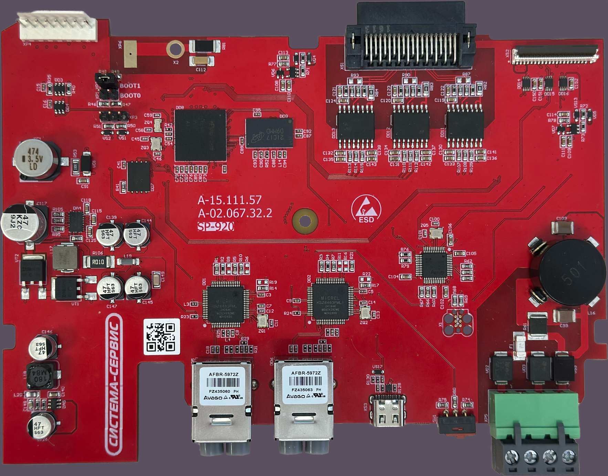

# SP-920 (HPM6754)



Project for the custom SP-920 board (HPM6754) using HPM SDK.

## Features
- SDRAM test (March algorithms)
- EEPROM MAC address read (I2C)
- RS-485 test
- Clock test
- lwIP-based Ethernet communication

## Requirements
- CMake
- Git
- Python
- Ninja
- RISC-V GNU Toolchain
- HPM SDK v1.11.0

## Setup

Follow the official HPM SDK documentation:

- https://hpm-sdk.readthedocs.io/en/latest/get_started.html
- https://hpm-sdk.readthedocs.io/en/latest/cmake_user_guide.html

HPM SDK repository:
- https://github.com/hpmicro/hpm_sdk

> Note: HPM SDK should be placed **outside** this project directory.

## Build

Run the following commands from the **project root directory** (where `CMakeLists.txt` is located):

```bash
cmake -G Ninja -B build -S . -DBOARD=sp-920 -DBOARD_SEARCH_PATH="<path-to-project>/boards" -DCMAKE_BUILD_TYPE=debug -DHPM_BUILD_TYPE=flash_xip
cmake --build build
```
